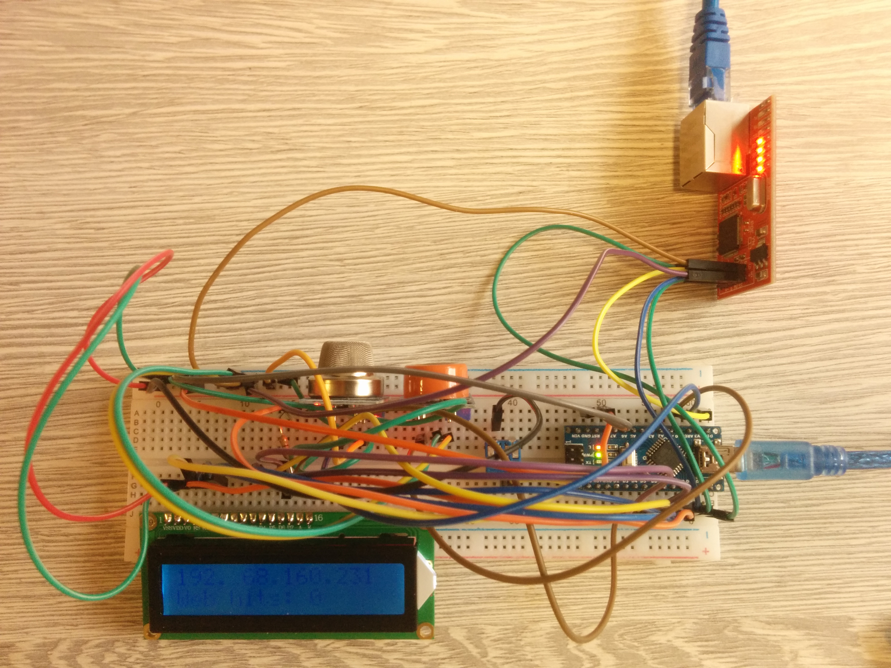

# Arduino Nano web server which displays IP address on LCD screen

Code and wiring instructions for Arduino Nano based web server, which displays its IP address on 16x2 LCD display.

# Required parts

1. 1 x Arduino Nano
2. 1 x LCD 16x2 display (HD44780)
3. 1 x 10k Ohm potentiometer
4. 1 x 220 Ohm resistor
5. 1 x Ethernet shield HanRun (HR911105A, 17/20)
6. 2 x MQx gas sensors (for instance MQ-135 and MQ-9)

You will also need breadboard, some wires and ethernet cable.

# How does it work?

1. Arduino Nano with ethernet card gets its IP address via DHCP when ethernet cable is connected.
2. When it gets IP address, IP address is displayed on LCD display.
3. Arduino Nano is then running web server on that IP address.
4. When client connects to webserver, it gets simple website showing values of analog readings from A0 and A1. Analog readings are from two MQ-x gas sensors.

# Wiring instructions

*LCD 16x2 (HD44780) - Arduino Nano*

 1. VSS Arduino GND
 2. VDD - Arduino 5V
 3. V0 (contrast) - 10k Ohm potentiometer (connect one wire to center pin and the other to left/right pin) - Arduino GND
 4. RS - Arduino D9
 5. RW - Arduino D8
 6. E (enable) - Arduino D7
 7. D0 (data 0) - not connected   
 8. D1 - not connected   
 9. D2 - not connected   
 10. D3 - not connected  
 11. D4 - Arduino D5
 12. D5 - Arduino D4
 13. D6 - Arduino D3
 14. D7 - Arduino D2
 15. A (backlight +) - 220 Ohm resistor (40 Ohm min.) - Arduino D6
 16. K (backlight GND) - GND

If there is no text displayed, LCD module may be out of sync with Arduino.
In that case press the reset button on your Arduino to synchronize (it may take a couple of resets).
Could be used for similar types of displays (for instance 20x4 LCD).

Source: [https://www.hacktronics.com/Tutorials/arduino-character-lcd-tutorial.html](URL)

*Ethernet shield HanRun (HR911105A, 17/20) - Arduino Nano*

 1. V+5 - 5V
 2. GND - GND
 3. NSS - D10
 4. MO - D11
 5. SOK - D13
 6. MI - D12

Source: [https://www.jdohnalek.com/arduino-nano-and-wiznet-w5100-red/](URL)

*MQx sensor - Arduino Nano*

 1. A0 - A0 (or A1 if you are using two sensors)
 2. D0 - not connected
 3. GND - GND
 4. VCC - 5V
